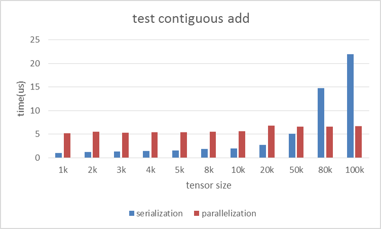
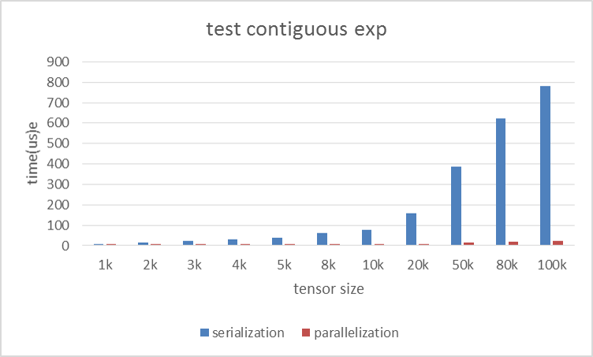
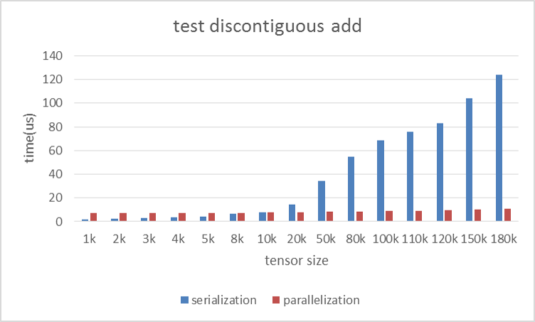
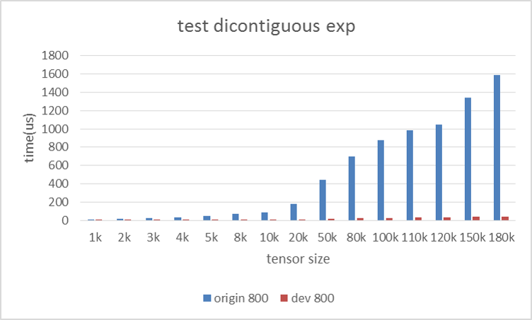

Pytorch element-wise operations optimization benchmark
=======

### 1. Abstract
Providing a benchmark for element-wise operations with or without optimization on different types of CPU. The data of copy, add, div, exp and sin operation is available now.   

Some general conclusions from this benchmark:  

- The OpenMP overhead threshold of official version is too high to help contiguous tensors of small and medium size benefit from OpenMP parallelism.
-	Operations of discontiguous tensors can be boosted a lot by using __Intel Pytorch__ .
-	The optimal OpenMP overhead threshold is dependent on the specific operation and the CPU type.   

This benchmark also gives a rough estimation of optimal OpenMP overhead threshold of copy, add, div, exp and sin operation on different types of CPU.   

### 2. Our main work
-	Optimal OpenMP overhead threshold is identified to maximize performance in CPU  
The OpenMP overhead threshold of official Pytorch is set to 100K. However, we benchmarked copy, add, div, exp, sin operation in both contiguous and discontiguous cases on different CPU types to show that the value is too high. A rough estimation of optimal OpenMP overhead threshold is proposed for those operations.
- Many operations of discontiguous tensors are parallelized by using OpenMP  
Slice operation of tensor is very common in science computation. Using slice operation will generate discontiguous tensor. Meanwhile, [Official Pytorch](https://github.com/pytorch/pytorch) does not support parallelism for discontiguous tensor for the moment. Our main work is tring to fill the blank. You can view the code from the [branch](https://github.com/intel/pytorch/tree/dev-omp2) of Intel Pytorch. We are also engaging to contribute our work to official Pytorch, the corresponding branch is [__dev-omp__](https://github.com/intel/pytorch/tree/dev-omp).


  
### 3. Installation and test
#### 3.1 Installation
##### Official Pytorch   
Please refer to official [__link__](https://github.com/pytorch/pytorch)  
##### Intel Pytorch 
The installation manual is mainly modified from official pytorch. What you should pay attention on is that the branch is __dev-omp2__.  

To get a high quality BLAS library (MKL) and a convenient package manager conda, we highly recommend you to install [Anaconda](https://www.continuum.io/downloads) environment. 

Once you have [Anaconda](https://www.continuum.io/downloads) installed, you can follow the instructions below:

If you want to develop with different pytorch versions at the same time, you may need to create several python virtual environments. Here are the instructions.
```bash
conda install virtualenv  
virtualenv [your-env-name]
```
After creating the virtual environment, you can activate it by typing
```bash
source your-env-path/bin/activate
```
If this is done successfully, you could see the virtual environment name in the front of your command line.  
Now you can install pytorch in this virtual environment without interfering with others. To switch between different virtual environments, you can follow this.
```bash
deactivate ---to exit an environment
source your-env-path/bin/activate ---to enter an environment
```
Download Intel pytorch source code.
```bash
git clone --recursive -b dev-omp2 https://github.com/intel/pytorch.git
```
Before installing, you should disable the CUDA support, and set the CMAKE_PREFIX_PATH.
```
export NO_CUDA=1
export CMAKE_PREFIX_PATH="$(dirname $(which conda))/../" # [anaconda root directory]
```
Install intel Pytorch
```
python setup.py install
```


#### 3.2 Test

You can get the performance data by using the format of command below after activating your corresponding pytorch. You must be conscious that which pytorch you are using.
```bash
python benchmark.py <benchmark num> <output file name> 
```
where `benchmark num` is an integer among `1, 2`, set it to `1` for benchmark in section 4.1, to `2` for benchmark in section 4.2.  


### 4. The benchmark result
We will release the benchmark on a desktop CPU, and server CPU. The specific model is below here.

|CPU Model|Sockets|Cores/Socket|Frequency|
|---|---|---|---|
|Intel(R) Xeon(R) CPU E5-2699 v4   |2|22|2.20GHz|
|Intel(R) Xeon(R) Platinum 8180 CPU|2|28|2.50GHz|

The data we achieved for now is from the server CPU. The data may fluctuate a little in a same CPU because of the complex environment.

#### 4.1 OpenMP overhead threshold of official Pytorch is too high
Add, exp operation for contiguous tensors whose sizes range from 1K to 100K are listed here as test cases. We compiled two versions of official Pytorch by setting two different OpenMP overhead [threshold](https://github.com/pytorch/pytorch/blob/master/aten/src/TH/generic/THTensorMath.c#L13). The threshold of one version is set to 100K to make all of the test case runs in series. Meanwhile the threshold of the other one is set to 800 to make all of the test case in parallel. 

Platform: Platinum 8180  
Operation: add  
Tensor Continuity: contiguous    
Unit: microsecond    

Time cost result is below:  

|Tensor Size|serialize|parallelize|SpeedUp|
|---|---:|---:|---:|
|1k	|1.04	|5.15|		0.20X      |
|2k	|1.23	|5.47|		0.22X      |
|3k	|1.33	|5.34|		0.24X      |
|4k	|1.47	|5.41|		0.27X      |
|5k	|1.48	|5.40|		0.27X      |
|8k	|1.81	|5.55|		0.32X      |
|10k|1.98	|5.66|		0.35X      |
|20k|2.74	|6.74|		0.40X      |
|50k|5.12	|6.59|		0.77X      |
|80k|14.79|6.59|		2.24X      |
|100k|21.97|6.70|		3.27X      |



Conclusion: Setting the threshold to __80K__ is good for __add operation__ of contiguous tensors. 

Platform: Platinum 8180  
Operation: exp  
Tensor Continuity: contiguous    
Unit: microsecond    

Time cost result is below:  

|Tensor Size|serialize|parallelize|SpeedUp|
|---|---:|---:|---:|
|1k	|9.48	|5.66|		1.67X      |
|2k	|17.00	|6.35|		2.67X      |
|3k	|24.82	|6.03|		4.11X      |
|4k	|32.52	|6.28|		5.17X      |
|5k	|40.33	|6.27|		6.42X      |
|8k	|63.58	|7.04|		9.02X      |
|10k|79.13	|7.61|		10.38X      |
|20k|156.78	|9.11|		17.20X      |
|50k|387.85	|15.07|		25.73X      |
|80k|623.34 |20.23|		30.80X      |
|100k|779.95|23.57|		33.08X      |



Conclusion: Setting the threshold to __1K__ is good for __exponential operation__ of contiguous tensors.  

From above results, it is easy to understand that,

- Different operations have their own optimal OpenMP overhead threshold, but 100K is never suitable.
- OpenMP overhead threshold for specific operation goes low as the operation is more complex.
  
We don't list all the detailed data for div and sin operation but provide a rough estimation of optimal OpenMP overhead threshold for different operations.

Platform: Platinum 8180

|Operation|optimal OpenMP overhead threshold|  
|---|---:|  
|contiguous copy|80K|  
|contiguous add |80K|  
|contiguous div	|50K|  
|contiguous exp	|1k	|  
|contiguous sin	|1k |   

#### 4.2 openmp can speedup operations of most of discontiguous tensor 
Add and exp operation for discontiguous tensors whose sizes range from 1K to 180K are listed here as the test cases. Official pytorch does not optimize operations for discontiguous tensors with OpenMP but Intel version does. In order to expalin that OpenMP also do good in discontiguous tensor operations and to find a optimal OpenMPoverhead threshold, we compiled two versions of Pytorch. One is the Official Pytorch. You should be conscious that all the test cases will run in series by using offcial one because it does not implement the corresponding code. The other one is the Intel one whose OpenMP overhead threshold is set to 800. We set the threshold to such a low value to make all of the test case in parallel. You will discover that Intel one can get better performance when the sizes of tensors exceed the critical point. It is that the critical point is the optimal OpenMP overhead threshold.

Platform: Platinum 8180  
Operation: add  
Tensor Continuity: discontiguous    
Unit: microsecond   

Time cost result is below:  

|Tensor Size|serialize|parallelize|SpeedUp|
|---|---:|---:|---:|
|1k|	1.69    |	6.98	|	0.24X |
|2k|	2.42    |	7.47	|	0.32X |
|3k|	3.12 	|	7.38 	|	0.42X |
|4k|	3.77  	|	7.43  	|	0.50X |
|5k|	4.46 	|	7.47	|	0.59X |
|8k|	6.44 	|	7.49	|	0.85X |
|10k|	7.82 	|	7.69	|	1.01X |
|20k|	14.54	|   7.80	|   1.86X |
|50k|	34.35 	|	8.31 	|	4.13X |
|80k|	54.80 	|	8.68 	|	6.31X |
|100k|	68.82 	|	9.07 	|	7.58X |
|110k|  75.92	|   8.99	|   8.43X |
|120k|  83.03	|   9.52	|   8.71X |
|150k|  104.24	|   9.92	|   10.50X|
|180k|  124.28	|   10.68	|   11.62X|



Conclusion: Setting the threshold to 10K is good for __add operation__ of discontiguous tensors. 
   
Platform: Platinum 8180  
Operation: exp    
Tensor Continuity: discontiguous    
Unit: microsecond    

Time cost result is below:  

|Tensor Size|serialize|parallelize|SpeedUp|
|---|---:|---:|---:|
|1k	|10.02	  |7.27	|	1.37X|
|2k	|19.01   	|7.83 |	2.42X|
|3k	|27.73   	|7.48 |	3.70X|
|4k	|36.45		|7.66	|	4.75X|
|5k	|45.26		|8.13	|	5.56X|
|8k	|71.36		|8.70	|	8.19X|
|10k|88.75		|9.15   |	9.69X|
|20k|176.26		|11.32  |	15.56X|
|50k|439.68		|19.07	|	23.04X|
|80k|700.40		|26.99	|	25.94X|
|100k|876.42	|27.61 	|	31.73X|
|110k|983.76	|29.79	|	33.01X|
|120k|1050.07	|31.87	|	32.94X|
|150k|1341.23	|37.59	|	35.67X|
|180k|1584.88	|43.27	|	36.62X|  



Conclusion: Setting the threshold to 1K is good __exponential operation__ of contiguous tensors. 

Some conclusions can be drawn from above results. 

- Discontiguous operation can be improved a lot by using OpenMP optimization.
- OpenMP overhead threshold of discontiguous tensor is usually lower than that of contiguous tensor because the same operation of discontiguous tensor consumes more time than that of contiguous tensor.
  
We don't list the detailed data for div and sin operation but provide a rough estimation of optimal OpenMP overhead threshold for different operations.

Platform: Platinum 8180  
  
|Operation|optimal OpenMP overhead threshold|  
|-------------------|---:|  
|discontiguous copy	|20K|  
|discontiguous add 	|20K|	  
|discontiguous div	|10K|  
|discontiguous exp	|1k	|  
|discontiguous sin	|2k |   

### 4. Conclusions
- Every operations have their own optimal OpenMP overhead threshold, but 100K is usually too high.
- OpenMP overhead threshold for specific operation decrease as the operation is more complex.
- Operations of discontiguous tensors in __Intel Pytorch__ can be improved a lot by utilizing OpenMP.
- OpenMP overhead threshold of discontiguous tensor usually is lower than that of contiguous tensor.
- All benchmark data are available in /benchmark-data.
