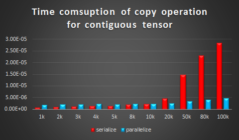

Pytorch element-wise operations benchmark with OpenMP
=======

### 1. Abstract
Providing benchmarks for basic elementwise operationon with or without openmp on different CPUs. Benchmark time data of copy and addition operation is available for now.  

Some general conclusions from this benchmarking:    
- Openmp usage of offcial version for contiguous tensor can be improved further. Intel version achieve nearly 1.5X on add operation when tensor size is greater than 100K.
- The openmp overhead threshold of official Pytorch is set too high, so that a lot of small and medium size tensor could not benefit from openmp parallelelism.
- No matter the tensors are contiguous or not, most operations can be boost by openmp.
- Setting the openmp overhead threshold to 2k~10k is OK, it is dependent on the specific operation and your CPU. We even set the value to 720 in our previous case for OpenNMT and achieve good performance.  

### 2. Our main work
Slice operation of tensor is very common in science computation. Using slice operation will generate discontiguous tensor. [__Official Pytorch__](https://github.com/pytorch/pytorch) does not support parallelism for discontiguous tensor for the moment. You can download a beta version which has enabled such feature from [__Intel-Pytorch__](https://github.com/intel/pytorch) to test the benchmark. The development branch is [__dev-omp2__](https://github.com/intel/pytorch/tree/dev-omp2) . We are also engaging to contribute our work to official Pytorch, the correspoding branch is  [__dev-omp__](https://github.com/intel/pytorch/tree/dev-omp).

### 3. Installation and test
#### 3.1 Installation
Official Pytorch   
Please refer to official [__link__](https://github.com/pytorch/pytorch)  
Intel-Pytorch 
To get a high quality BLAS library (MKL) and a convenient package manager conda, we highly recommend you to install [Anaconda](https://www.continuum.io/downloads) environment.

Once you have [Anaconda](https://www.continuum.io/downloads) installed, you can follow the instructions below:

If you want to develop with different pytorch versions at the same time, you may need to create several python virtual environments. Here are the instructions.
```bash
conda install virtualenv  
virtualenv [your-env-name]
```
After creating the virtual environment, you can activate it by typing
```bash
source your-env-path/bin/activate
```
If this is done successfully, you could see the virtual environment name in the front of your command line.  
Now you can install pytorch in this virtual environment without interfering with others. To switch between different virtual environments, you can follow this.
```bash
deactivate ---to exit an environment
source your-env-path/bin/activate ---to enter an environment
```
Download intel pytorch source code.
```bash
git clone --recursive -b dev-omp https://github.com/intel/pytorch.git
```
Before installing, you should disable the CUDA support, and set the CMAKE_PREFIX_PATH.
```
export NO_CUDA=1
export CMAKE_PREFIX_PATH="$(dirname $(which conda))/../" # [anaconda root directory]
```
Install intel Pytorch
```
python setup.py install
```


#### 3.2 Test
The performance data in Cloumn 2 of table below can be collected from offcial pytorch. And that in Column 3 can be collected from branch  [__dev-omp2__](https://github.com/intel/pytorch/tree/dev-omp2) of Intel pytorch.
You can get the performance data by using the command format below after activate your corresponding pytorch. You must be aware of which pytorch you are using.
```bash
python benchmark.py <benchmark num><output file name> 
```
where `benchmark num` is an integer among `1, 2, 3`, set it to `1` will reproduce benchmark in section 4.1, to 2 reproduce benchmark in section 4.2, to 3 reproduce benchmark in section 4.3.  


### 4. The benchmark result
We will release the benchmark on a desktop CPU, and server CPUs like Xeon and Xeon Phi. The specific model is below here.

|Type|desktop|Xeon|Xeon Phi|
|---|---:|---:|---:|
|Model|i7-5960X|E5-2699 v4|CPU 7250F|

The data we achieved fo now is from the desktop CPU. You must note that all the data are collected from desktop CPU Intel(R) Core(TM) i7-5960X CPU @ 3.00GHz, The data may fluctuate in the same model CPUs because of complex environment.

#### 4.1  Parallelism implementation of official version can be improved.
We choose add operation for contiguous tensors that are greater than 100K as the test case. Because:
- Official version does not support parallelsim for distontiguous tensor.  
- Official version does not support copy parallelism. [Link](https://github.com/pytorch/pytorch/blob/master/torch/lib/TH/generic/THTensorCopy.c#L77).    
- The value is set to 100k because official version set the openmp overhead threshold as [100K](https://github.com/pytorch/pytorch/blob/master/torch/lib/TH/generic/THTensorMath.c#L13).   

Operation: add  
Tensor Continuity: contiguous  
Unit: s  
Time cost result is below.  

|Tensor Size|Official version|Intel version|SpeedUp|
|---|---:|---:|---:|
|110k|	1.17E-05|	5.72E-06|		2.05X|
|120k|	1.05E-05|	5.95E-06|		1.77X|
|150k|	1.31E-05|	7.47E-06|		1.75X|
|180k|	1.36E-05|	8.24E-06|		1.65X|

![][benchmark-charts/contiguous_add_bigsize]

Both of the two versions use openmp to parallelize the add operation. And they both use Intel Intrinsics as SIMD to implement vectorization. We should pay attention to the remainder part when using SIMD. The offical version [split](https://github.com/pytorch/pytorch/blob/master/torch/lib/TH/generic/THTensorMath.c#L51-L62) the size of tensors and assign some to different threads first and then use [SIMD](https://github.com/pytorch/pytorch/blob/master/torch/lib/TH/vector/AVX.c#L13-L16). It maybe results in a remainder part in each thread. But Intel version think the remainder from SIMD first and make sure there is no remainder in each thread when doing parallelism. 

#### 4.2 Openmp overhaed threshold of official Pytorch is too high
We choose add and copy operation for contiguous tensors that are less than 100K as the test case. The code of official version runs serailly and the Intel version runs parallelly. 
You can use the two versions as test method to reproduce the data.

Operation: copy  
Tensor Continuity: contiguous  
Unit: second  

Time cost result is below:  

|Tensor Size|serialize|parallelize|SpeedUp|
|---|---:|---:|---:|
|1k	|8.10E-07	|2.03E-06|		0.40X      |
|2k	|1.02E-06	|2.18E-06|		0.47X      |
|3k	|1.23E-06	|2.20E-06|		0.56X      |
|4k	|1.46E-06	|2.28E-06|		0.64X      |
|5k	|1.56E-06	|2.23E-06|		0.70X      |
|8k	|2.07E-06	|2.34E-06|		0.88X      |
|10k|2.42E-06	|2.37E-06|		1.02X      |
|20k|4.65E-06	|2.57E-06|		1.81X      |
|50k|1.48E-05	|3.50E-06|		4.24X      |
|80k|2.29E-05	|4.18E-06|		5.49X      |
|100k|2.82E-05	|4.67E-06|		6.05X      |

[][contiguous copy]

Conclusion: Setting the threshold to 10K is good. 

Operation: add  
Tensor Continuity: contiguous  
Unit: second

Time cost result is below:  

|Tensor Size|serialize|parallelize|SpeedUp|
|---|---:|---:|---:|
|1k		|1.41E-06|	2.31E-06|		0.61X |
|2k		|1.73E-06|	2.42E-06|		0.71X |
|3k		|1.90E-06|	2.42E-06|		0.79X |
|4k		|2.12E-06|	2.51E-06|		0.84X |
|5k		|2.23E-06|	2.47E-06|		0.90X |
|8k		|2.78E-06|	2.46E-06|		1.13X |
|10k	|3.29E-06|	2.52E-06|		1.31X |
|20k	|5.99E-06|	2.81E-06|		2.13X |
|50k	|1.59E-05|	3.76E-06|		4.22X |
|80k	|2.32E-05|	4.34E-06|		5.34X |
|100k	|2.84E-05|	5.27E-06|		5.38X |

![][benchmark-charts/contiguous_add]

Conclusion: Setting the threshold to 8K is good. 

If you are familar of pytorch or torch [code](https://github.com/pytorch/pytorch/blob/master/torch/lib/TH/vector/AVX.c#L13-L16) and SIMD(2x256bit = 8x64bit = 8xsizeof(double)), you will know 2k may be OK if not using SIMD. It will be verified in next section.

### 4.3 openmp can speedup most of discontiguous tensor operations
We choose add and copy operation for discontiguous tensors that are not great than 100K as the test case. The code of official version runs serailly and the Intel version runs parallelly. 
You can use the two versions as test method to reproduce the data.

Operation: copy  
Tensor Continuity: discontiguous  
Unit: second 

Time cost result is below:  

|Tensor Size|serialize|parallelize|SpeedUp|
|---|---:|---:|---:|
|1k|	4.06E-05    |	4.08E-05	|	0.99X |
|2k|	7.29E-05    |	7.31E-05	|	1.00X |
|3k|	0.000107481 |	0.000107489 |	1.00X |
|4k|	0.0001428   |	0.00014282  |	1.00X |
|5k|	0.000178143 |	2.42E-05	|	7.37X |
|8k|	0.000282163 |	3.74E-05	|	7.54X |
|10k|	0.000304949 |	4.64E-05	|	6.58X |
|20k|	0.000607821	|   9.09E-05	|   6.69X |
|50k|	0.001517918 |	0.000223913 |	6.78X |
|80k|	0.002426437 |	0.000347781 |	6.98X |
|100k|	0.003033556 |	0.000668404 |	4.54X |

![][benchmark-charts/discontiguous_copy]

Conclusion: Setting the threshold to 4K is good. 2K maybe is also a good choice if considering test error.
   
Operation: add  
Tensor Continuity: discontiguous  
Unit: second  

Time cost result is below:  

|Tensor Size|serialize|parallelize|SpeedUp|
|---|---:|---:|---:|
|1k	|3.10E-05	    |3.29E-05	|	0.94X|
|2k	|6.25E-05    	|6.63E-05   |	0.94X|
|3k	|9.31E-05   	|9.88E-05   |	0.94X|
|4k	|0.000123635	|0.000131106|	0.94X|
|5k	|0.000154134	|2.45E-05	|	6.30X|
|8k	|0.000245698	|3.78E-05	|	6.50X|
|10k|0.000306864	|4.57E-05   |	6.71X|
|20k|0.000612429	|8.38E-05   |	7.30X|
|50k|0.001527853	|0.000440896|	3.47X|
|80k|0.002441799	|0.000360663|	6.77X|
|100k|0.003052302	|0.00044265 |	6.09X|

![][benchmark-charts/discontiguous_add]

Conclusion: Setting the threshold to 5K is good. 

#### 4.4 Setting the openmp overhead threshold to 2k~10k is OK
It can be concluded from the tests above.
