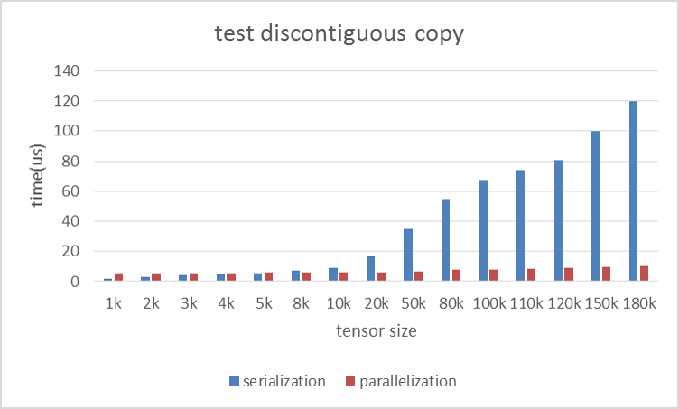
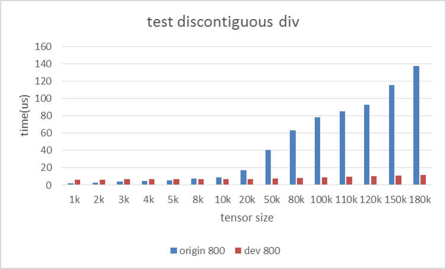
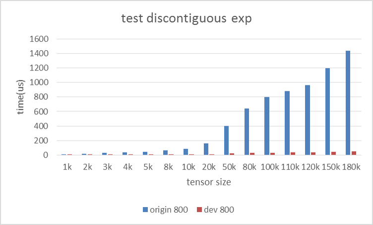
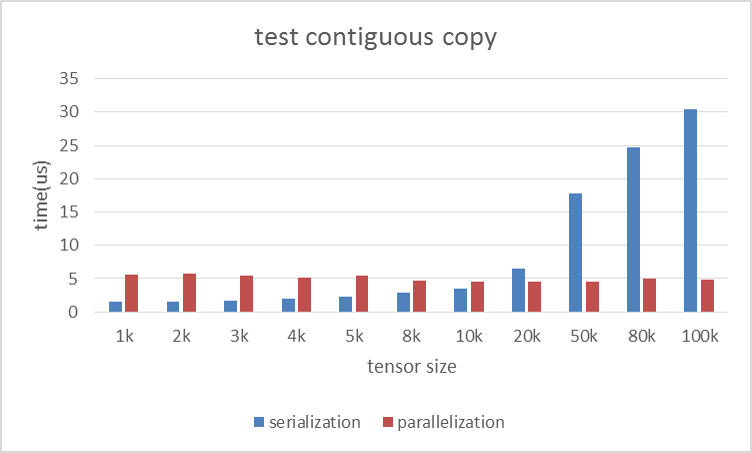
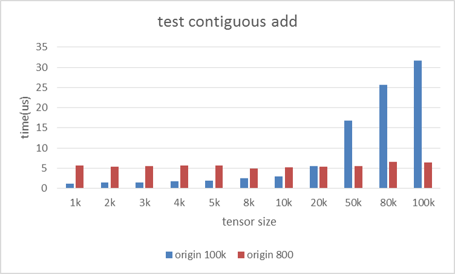
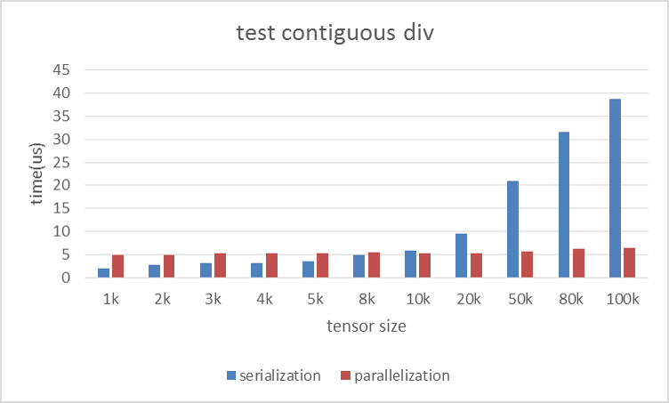
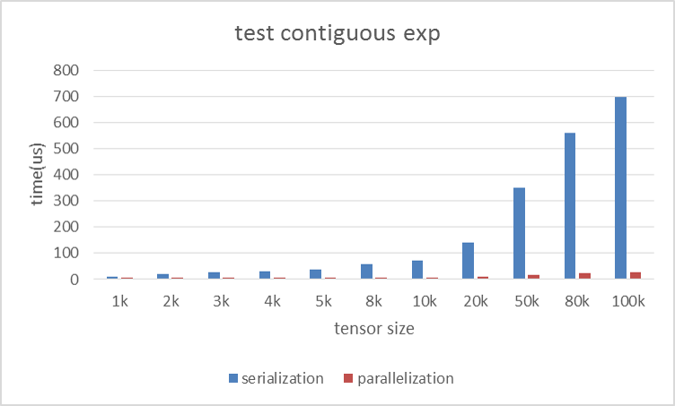
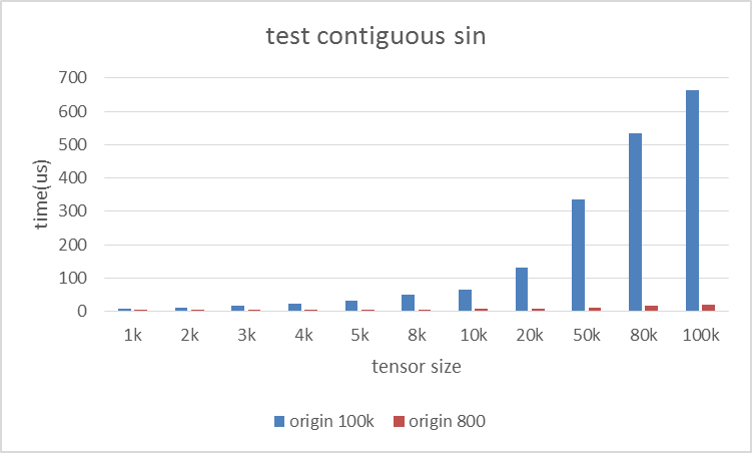

Benchmark data on Intel(R) Xeon(R) CPU E5-2699 v4  
=======
Operation: copy   
Tensor Continuity: discontiguous        
Unit: microsecond     

|Tensor size|Serialize|Parallel|Speedup|  
|---|---:|---:|---|  
|1k	|2.04	|5.50	|0.37X|  
|2k	|3.03	|5.45	|0.55X|  
|3k	|3.92   |5.58	|0.70X|  
|4k	|4.59	|5.60	|0.81X|  
|5k	|5.42	|5.80	|0.93X|  
|8k	|7.35	|5.95	|1.23X|  
|10k|8.82	|5.97	|1.47X|  
|20k|16.75	|6.11	|2.73X|  
|50k|34.75	|6.79	|5.11X| 
|80k|54.53	|7.73	|7.04X|  
|100k|67.40 |8.08	|8.34X|  
|110k|73.99	|8.57	|8.62X|  
|120k|80.54	|8.87	|9.07X|  
|150k|100.00|9.83	|10.17X|
|180k|119.65|10.37	|11.53X|  

***
Operation: add   
Tensor Continuity: discontiguous  
Unit: microsecond  

|Tensor size|Serialize|Parallel|Speedup|      
|---|---:|---:|---|      
|1k	|1.87 	|5.85 	|0.31X|  
|2k	|2.76 	|5.82 	|0.47X|  
|3k	|3.59	|5.95	|0.60X|  
|4k	|4.33	|5.96	|0.72X|  
|5k	|5.08	|6.18	|0.82X|  
|8k	|7.38	|6.10	|1.21X|  
|10k|8.94	|6.09	|1.46X|  
|20k|17.02	|6.43	|2.64X|  
|50k|40.12	|7.14	|5.61X|  
|80k|62.50	|7.98	|7.82X|  
|100k|77.47	|8.34	|9.27X|  
|110k|84.99 |8.69	|9.77X|  
|120k|92.45	|9.14	|10.11X|  
|150k|114.74|10.05	|11.41X|  
|180k|137.13|10.69	|12.82X|  
  
  
***
Operation: div   
Tensor Continuity: discontiguous  
Unit: microsecond  

|Tensor size|Serialize|Parallel|Speedup|      
|---|---:|---:|---|       
|1k	|2.11	|6.44	|0.33X|  
|2k	|2.98	|6.49	|0.46X|  
|3k	|3.77	|6.55	|0.58X|  
|4k	|4.53	|6.65	|0.68X|  
|5k	|5.28	|6.76	|0.78X|  
|8k	|7.61	|6.67	|1.14X|
|10k|9.15	|6.69	|1.37X|
|20k|17.39	|7.10	|2.45X|
|50k|40.58	|7.87	|5.16X|  
|80k|63.12	|8.54	|7.39X|  
|100k|78.09	|9.05	|8.63X|
|110k|85.53	|9.39	|9.10X|  
|120k|93.09	|10.03	|9.28X|
|150k|115.31|10.73	|10.75X|
|180k|137.86|11.38	|12.12X|  

***
Operation: exp     
Tensor Continuity: discontiguous  
Unit: microsecond  

|Tensor size|Serialize|Parallel|Speedup|      
|---|---:|---:|---|      
|1k		|9.44	|6.47	|1.46X|    
|2k		|17.61	|6.82	|2.58X|  
|3k		|25.60	|7.10	|3.61X|  
|4k		|33.70	|7.34	|4.59X|  
|5k		|41.65	|7.66	|5.44X|  
|8k		|65.72	|8.25	|7.96X|  
|10k	|81.76	|8.58	|9.53X|  
|20k	|162.51	|11.16	|14.56X|  
|50k	|402.76	|19.48	|20.68X|  
|80k	|642.27	|26.99	|23.79X|   
|100k	|801.74	|31.99	|25.06X|  
|110k	|881.57	|34.84	|25.30X|   
|120k	|961.27	|37.41	|25.70X|  
|150k	|1200.41|44.81	|26.79X|  
|180k	|1439.48|52.61	|27.36X|  
  
  
***
Operation: sin     
Tensor Continuity: discontiguous  
Unit: microsecond  

|Tensor size|Serialize|Parallel|Speedup|      
|---|---:|---:|---|      
|1k		|6.20	|6.27	|0.99X|  
|2k		|12.22	|6.38	|1.92X|  
|3k		|18.09	|6.61	|2.74X|  
|4k		|24.21	|6.56	|3.69X|  
|5k		|30.29	|6.96	|4.35X|  
|8k		|49.18	|7.16	|6.87X|  
|10k	|61.89	|7.51	|8.24X|  
|20k	|123.60	|8.86	|13.96X|  
|50k	|305.38	|14.57	|20.96X|  
|80k	|486.16	|20.07	|24.22X|  
|100k	|607.44	|23.28	|26.09X|  
|110k	|668.37	|25.13	|26.59X|  
|120k	|728.72	|26.81	|27.18X|  
|150k	|909.86	|32.54	|27.96X|  
|180k	|1091.06|37.73	|28.92X|  

***
Operation: copy     
Tensor Continuity: contiguous  
Unit: microsecond  

|Tensor size|Serialize|Parallel|Speedup|      
|---|---:|---:|---|      
|1k		|1.47	|5.55	|0.26X|  
|2k		|1.61	|5.75	|0.28X|  
|3k		|1.65	|5.47	|0.30X|  
|4k		|1.99	|5.20	|0.38X|  
|5k		|2.26	|5.41	|0.42X|  
|8k		|2.94	|4.75	|0.62X|  
|10k	|3.45	|4.47	|0.77X|   
|20k	|6.45	|4.52	|1.43X|  
|50k	|17.73	|4.54	|3.90X|  
|80k	|24.70	|5.02	|4.92X|  
|100k	|30.44	|4.80	|6.34X|  

***
Operation: add     
Tensor Continuity: contiguous  
Unit: microsecond  

|Tensor size|Serialize|Parallel|Speedup|      
|---|---:|---:|---|      
|1k		|1.09	|5.57	|0.20X|  
|2k		|1.37	|5.39	|0.25X|  
|3k		|1.50	|5.55	|0.27X|  
|4k		|1.70	|5.63	|0.30X|  
|5k		|1.82	|5.59	|0.33X|  
|8k		|2.42	|4.92	|0.49X|  
|10k	|2.86	|5.25	|0.54X|  
|20k	|5.50	|5.41	|1.02X|  
|50k	|16.83	|5.43	|3.10X|  
|80k	|25.65	|6.57	|3.90X|  
|100k	|31.61	|6.35	|4.98X|  

***
Operation: div     
Tensor Continuity: contiguous  
Unit: microsecond  

|Tensor size|Serialize|Parallel|Speedup|      
|---|---:|---:|---|      
|1k		|2.07	|4.92	|0.42X|  
|2k		|2.66	|4.88	|0.55X|  
|3k		|3.11	|5.19	|0.60X|  
|4k		|3.18	|5.20	|0.61X|  
|5k		|3.56	|5.28	|0.68X|  
|8k		|4.90	|5.40	|0.91X|  
|10k	|5.79	|5.36	|1.08X|  
|20k	|9.59	|5.28	|1.82X|  
|50k	|20.90	|5.73	|3.65X|  
|80k	|31.59	|6.24	|5.06X|  
|100k	|38.66	|6.33	|6.10X|  

***
Operation: exp     
Tensor Continuity: contiguous  
Unit: microsecond  

|Tensor size|Serialize|Parallel|Speedup|      
|---|---:|---:|---|      
|1k		|10.70	|5.04	|2.12X|
|2k		|19.99	|5.58	|3.58X|
|3k		|28.91	|5.64	|5.12X|
|4k		|29.47	|5.88	|5.01X|
|5k		|36.47	|6.15	|5.93X|
|8k		|57.52	|6.84	|8.41X|
|10k	|71.62	|7.05	|10.16X|
|20k	|141.91	|9.32	|15.22X|
|50k	|351.45	|15.66	|22.45X|
|80k	|560.95	|22.55	|24.87X|
|100k	|699.73	|26.47	|26.43X|

***
Operation: sin     
Tensor Continuity: contiguous  
Unit: microsecond  

|Tensor size|Serialize|Parallel|Speedup|      
|---|---:|---:|---| 
|1k		|6.70	|5.10	|1.31X|  
|2k		|11.10	|5.15	|2.16X|  
|3k		|17.16	|5.38	|3.19X|  
|4k		|23.62	|5.32	|4.44X|  
|5k		|30.71	|5.78	|5.31X|  
|8k		|50.39	|5.89	|8.56X|  
|10k	|63.45	|6.21	|10.21X|  
|20k	|132.09	|7.38	|17.89X|  
|50k	|334.72	|11.55	|28.97X|  
|80k	|533.10	|17.48	|30.49X|  
|100k	|663.34	|20.65	|32.12X|  

***

