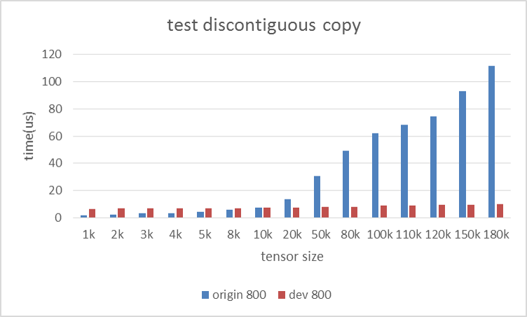
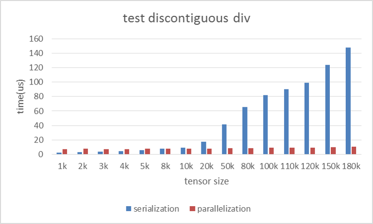
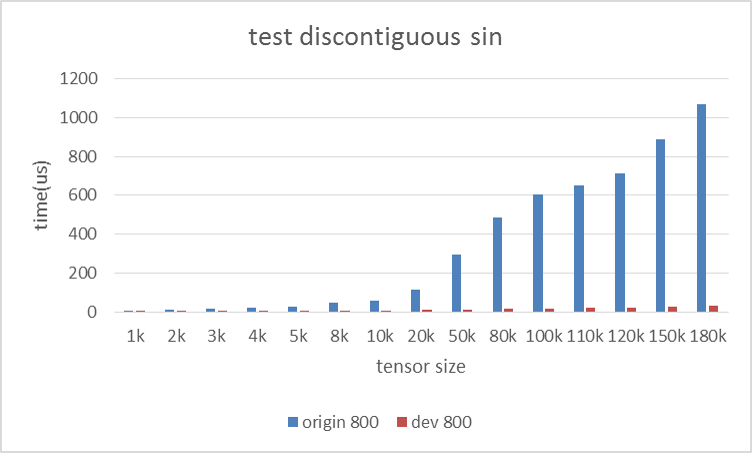
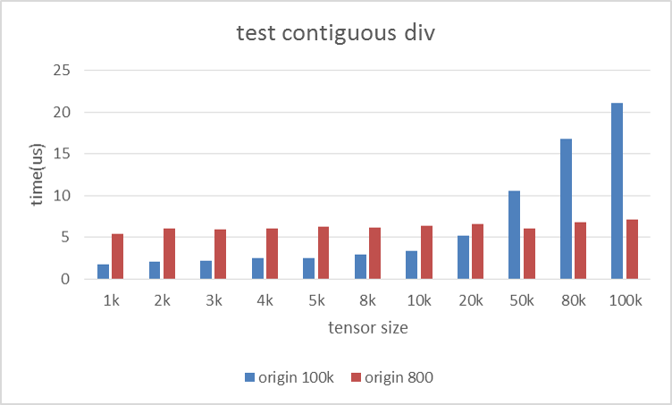
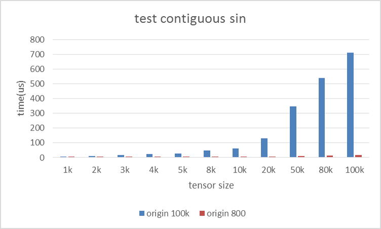

Benchmark data on  Intel(R) Xeon(R) Platinum 8180 CPU
=======
Operation: copy   
Tensor Continuity: discontiguous        
Unit: microsecond       

|Tensor size|Serialize|Parallel|Speedup|  
|---|---:|---:|---|  
|1k		|1.55	|6.35	|0.24X|  
|2k		|2.48	|7.14	|0.35X|  
|3k		|3.25	|6.90	|0.47X|  
|4k		|3.57	|6.70	|0.53X|  
|5k		|4.17	|6.88	|0.61X|  
|8k		|6.03	|7.07	|0.85X|  
|10k	|7.32	|7.32	|1.00X|  
|20k	|13.68	|7.37	|1.86X|  
|50k	|30.88	|7.83	|3.94X|  
|80k	|49.30	|8.23	|5.99X|  
|100k	|62.01	|8.78	|7.06X|  
|110k	|68.12	|8.94	|7.62X|  
|120k	|74.46	|9.29	|8.02X|  
|150k	|93.20	|9.65	|9.65X|  
|180k	|111.61	|10.22	|10.92X|  

***
Operation: add   
Tensor Continuity: discontiguous  
Unit: microsecond  

|Tensor size|Serialize|Parallel|Speedup|      
|---|---:|---:|---|      
|1k		|1.70	|6.99	|0.24X|  
|2k		|2.42	|7.48	|0.32X|  
|3k		|3.13	|7.38	|0.42X|  
|4k		|3.78	|7.44	|0.51X|  
|5k		|4.46	|7.47	|0.60X|   
|8k		|6.45	|7.50	|0.86X|  
|10k	|7.82	|7.70	|1.02X|  
|20k	|14.55	|7.80	|1.86X|  
|50k	|34.36	|8.32	|4.13X|  
|80k	|54.81	|8.68	|6.31X|  
|100k	|68.83	|9.08	|7.58X|  
|110k	|75.92	|9.00	|8.44X|  
|120k	|83.03	|9.53	|8.71X|  
|150k	|104.25	|9.93	|10.50X|  
|180k	|124.28	|10.69	|11.63X|   
  
  
***
Operation: div   
Tensor Continuity: discontiguous  
Unit: microsecond  

|Tensor size|Serialize|Parallel|Speedup|      
|---|---:|---:|---|       
|1k		|1.92	|6.90	|0.28X|  
|2k		|2.89	|7.44	|0.39X|  
|3k		|3.72	|7.24	|0.51X|  
|4k		|4.51	|7.29	|0.62X|  
|5k		|5.34	|7.40	|0.72X|  
|8k		|7.71	|7.51	|1.03X|  
|10k	|9.33	|7.51	|1.24X|  
|20k	|17.32	|7.65	|2.26X|  
|50k	|41.18	|8.51	|4.84X|  
|80k	|65.46	|8.72	|7.51X|  
|100k	|82.02	|9.08	|9.03X|  
|110k	|90.55	|9.30	|9.74X|  
|120k	|98.92	|9.12	|10.85X|  
|150k	|124.01	|9.83	|12.62X|  
|180k	|147.88	|10.60	|13.95X|    

***
Operation: exp     
Tensor Continuity: discontiguous  
Unit: microsecond  

|Tensor size|Serialize|Parallel|Speedup|      
|---|---:|---:|---|      
|1k		|10.02	|7.28	|1.38X|  
|2k		|19.02	|7.83	|2.43X|  
|3k		|27.74	|7.49	|3.70X|  
|4k		|36.46	|7.67	|4.75X|  
|5k		|45.26	|8.13	|5.56X|  
|8k		|71.36	|8.71	|8.20X|  
|10k	|88.76	|9.15	|9.70X|  
|20k	|176.27	|11.33	|15.56X|  
|50k	|439.68	|19.08	|23.05X|  
|80k	|700.40	|27.00	|25.94X|  
|100k	|876.42	|27.62	|31.73X|  
|110k	|983.77	|29.80	|33.01X|  
|120k	|1050.08|31.87	|32.95X|  
|150k	|1341.23|37.59	|35.68X|  
|180k	|1584.88|43.27	|36.62X|  

  
***
Operation: sin     
Tensor Continuity: discontiguous  
Unit: microsecond  

|Tensor size|Serialize|Parallel|Speedup|        
|---|---:|---:|---|        
|1k		|5.77	|7.20	|0.80X|  
|2k		|11.14	|7.59	|1.47X|  
|3k		|16.84	|7.62	|2.21X|  
|4k		|22.50	|7.59	|2.97X|   
|5k		|28.28	|7.79	|3.63X|  
|8k		|45.54	|7.97	|5.72X|  
|10k	|57.21	|8.17	|7.00X|  
|20k	|117.07	|9.03	|12.96X|  
|50k	|295.44	|12.34	|23.94X|  
|80k	|487.16	|16.20	|30.07X|  
|100k	|604.87	|19.09	|31.69X|  
|110k	|651.46	|20.38	|31.97X|  
|120k	|711.92	|23.35	|30.49X|  
|150k	|889.89	|26.57	|33.50X|  
|180k	|1068.41|31.07	|34.39X|  
  
  
***
Operation: copy       
Tensor Continuity: contiguous  
Unit: microsecond  

|Tensor size|Serialize|Parallel|Speedup|      
|---|---:|---:|---|      
|1k		|0.78	|4.69	|0.17X|  
|2k		|0.82	|4.74	|0.17X|  
|3k		|0.94	|4.76	|0.20X|  
|4k		|1.02	|4.75	|0.21X|  
|5k		|1.10	|4.85	|0.23X|  
|8k		|1.39	|4.88	|0.29X|  
|10k	|1.63	|5.11	|0.32X|  
|20k	|2.33	|5.23	|0.45X|  
|50k	|4.70	|5.10	|0.92X|  
|80k	|8.28	|5.13	|1.62X|  
|100k	|17.11	|5.27	|3.25X|  

***
Operation: add     
Tensor Continuity: contiguous  
Unit: microsecond  

|Tensor size|Serialize|Parallel|Speedup|      
|---|---:|---:|---|      
|1k		|1.04	|5.15	|0.20X|  
|2k		|1.24	|5.47	|0.23X|  
|3k		|1.34	|5.34	|0.25X|   
|4k		|1.47	|5.41	|0.27X|   
|5k		|1.49	|5.41	|0.28X|  
|8k		|1.82	|5.55	|0.33X|  
|10k	|1.99	|5.66	|0.35X|  
|20k	|2.75	|6.75	|0.41X|  
|50k	|5.12	|6.60	|0.78X|  
|80k	|14.79	|6.60	|2.24X|  
|100k	|21.97	|6.70	|3.28X|  

***
Operation: div     
Tensor Continuity: contiguous  
Unit: microsecond  

|Tensor size|Serialize|Parallel|Speedup|      
|---|---:|---:|---|      
|1k		|1.69	|5.41	|0.31X|  
|2k		|2.05	|6.09	|0.34X|  
|3k		|2.20	|5.92	|0.37X|  
|4k		|2.48	|6.00	|0.41X|  
|5k		|2.48	|6.24	|0.40X|  
|8k		|2.93	|6.14	|0.48X|  
|10k	|3.34	|6.41	|0.52X|  
|20k	|5.14	|6.55	|0.79X|  
|50k	|10.57	|6.05	|1.75X|  
|80k	|16.77	|6.75	|2.48X|  
|100k	|21.06	|7.12	|2.96X|  

***
Operation: exp     
Tensor Continuity: contiguous  
Unit: microsecond  

|Tensor size|Serialize|Parallel|Speedup|      
|---|---:|---:|---|      
|1k		|9.49	|5.66	|1.67X|  
|2k		|17.00	|6.35	|2.68X|  
|3k		|24.82	|6.04	|4.11X|  
|4k		|32.53	|6.28	|5.18X|  
|5k		|40.34	|6.28	|6.43X|  
|8k		|63.59	|7.04	|9.03X|  
|10k	|79.13	|7.62	|10.39X|  
|20k	|156.79	|9.11	|17.20X|  
|50k	|387.85	|15.07	|25.73X|  
|80k	|623.34	|20.24	|30.80X|  
|100k	|779.96	|23.58	|33.08X|  

***
Operation: sin     
Tensor Continuity: contiguous  
Unit: microsecond  

|Tensor size|Serialize|Parallel|Speedup|      
|---|---:|---:|---| 
|1k		|6.41	|5.42	|1.18X|  
|2k		|11.01	|5.72	|1.93X|  
|3k		|17.36	|5.49	|3.16X|  
|4k		|23.85	|5.81	|4.10X|  
|5k		|28.91	|6.05	|4.78X|  
|8k		|48.73	|6.41	|7.61X|  
|10k	|61.79	|6.53	|9.46X|  
|20k	|129.26	|7.54	|17.13X|  
|50k	|346.91	|10.18	|34.09X|  
|80k	|540.95	|13.49	|40.09X|  
|100k	|712.20	|17.17	|41.48X|  

